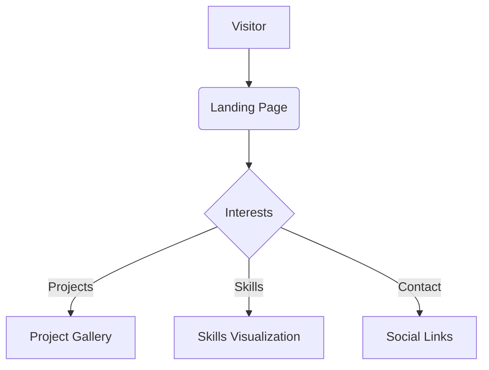

# Bryce Studios Portfolio 

  
  
  
  
  
  

  *Creating unique solutions to everyday problems*

## 🚀 About This Project

A modern portfolio showcasing my work. Built with:

- **Semantic HTML5** for accessibility
- **CSS Variables** for theming (dark/light mode)
- **Lottie Animations** for engaging interactions
- **Particles.js** for dynamic backgrounds
- **Responsive Design** that works on all devices

## ✨ Key Features

| Feature        | Description                                                                 |
|---------------|----------------------------------------------------------------------------|
| **Dark/Light Mode** | Automatically adapts to system preferences with smooth transitions |
| **Interactive Elements** | Animated buttons, hover effects, and scroll-triggered animations |
| **Performance Optimized** | Prefers-reduced-motion support and lazy loading |
| **Modern Aesthetics** | Gradient backgrounds with particle effects |

## 🌈 Color Scheme

| Color          | Hex       | Usage               |
|----------------|----------|--------------------|
| Primary Blue   | `#1DA1F2` | Buttons, Links     |
| Coral Accent   | `#FF6B6B` | Hover States       |
| Light BG      | `#f8f9fa` | Light Mode Background |
| Dark BG       | `#1a1a1a` | Dark Mode Background |

## 🤝 Connect With Me

---

  Made with ♥ by Bryce Studios

